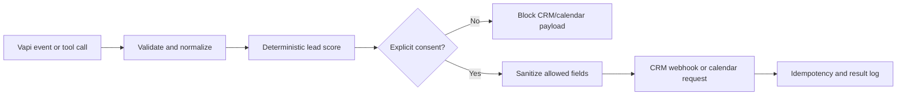

# Consent-aware AI voice lead pilot

[](https://github.com/parkkiyun/consent-aware-voice-lead-pilot/actions/workflows/test.yml)

A small, dependency-free Node.js service that demonstrates a real Vapi integration for a 24-hour paid pilot. It receives Vapi Server URL events, scores permission-based leads, and forwards a sanitized outcome to a CRM webhook.

## Verify it in 60 seconds

1. Open the [live zero-network demo](https://parkkiyun.github.io/consent-aware-voice-lead-pilot/), run the synthetic lead, then withdraw follow-up consent and confirm that no CRM payload is produced.
2. Open the [public test runs](https://github.com/parkkiyun/consent-aware-voice-lead-pilot/actions/workflows/test.yml) and confirm the latest `main` run is green.
3. Open the [Swiss HVAC exact-match quote prototype](https://parkkiyun.github.io/consent-aware-voice-lead-pilot/swiss-hvac-quote.html) and confirm that an unknown line remains unpriced.
4. Run `npm test` locally to reproduce the same eighteen checks without credentials or paid services.

| Buyer requirement | Inspectable implementation | Executable proof |
|---|---|---|
| Vapi function calling | `src/server.mjs`, `examples/assistant-template.json` | `test/server.test.mjs`, `test/artifacts.test.mjs` |
| Deterministic 0-100 qualification | `src/qualify.mjs` | `test/qualify.test.mjs` |
| Consent-gated CRM handoff | `src/server.mjs`, `examples/n8n-vapi-lead-pilot.json` | `test/server.test.mjs`, `test/artifacts.test.mjs` |
| Consent-gated calendar request | `src/calendar.mjs`, `src/server.mjs`, `examples/n8n-vapi-lead-pilot.json` | `test/calendar.test.mjs`, `test/server.test.mjs`, `test/artifacts.test.mjs` |
| Fast, minimized ElevenLabs post-call intake | `examples/n8n-elevenlabs-post-call-reference.json` | executable Code-node checks in `test/artifacts.test.mjs` |
| Sanitized central n8n error envelope | `examples/n8n-error-handler-reference.json` | retry classification and data-exclusion checks in `test/artifacts.test.mjs` |
| Swiss HVAC exact-catalog quoting and PDF output | `src/swissQuote.mjs`, `examples/n8n-swiss-hvac-quote-reference.json`, `examples/swiss-hvac-sample-quote.pdf` | exact-match, exception, pricing, n8n Code-node, and PDF-source parity checks |
| Privacy and duplicate protection | sanitized payload builders and deterministic idempotency keys | consent-withdrawal, unsafe-input, and repeat-event tests |



## What is already implemented

- Vapi `tool-calls` request/response handling for `qualifyLead`
- Vapi `tool-calls` handling for a consent-gated, sanitized calendar request
- Deterministic hot/warm/nurture scoring with input validation
- Brief-matched scoring across budget, timeline, office size, decision-maker status, need, and contactability; hot threshold is 90/100
- End-of-call report processing with idempotency
- Optional CRM webhook forwarding
- Timing-safe webhook-secret validation
- 256 KiB request limit and five-second CRM timeout
- Privacy guardrail: raw transcripts and recording URLs are never forwarded
- Consent guardrail: no CRM forwarding without explicit follow-up consent
- Scheduling guardrail: no calendar request without explicit consent, attendee email, exact time, duration, and IANA time zone
- Deterministic calendar idempotency key; no live calendar is called by the proof
- Fast-200 ElevenLabs post-call reference with an explicit upstream-HMAC gate, deterministic `conversation_id` idempotency key, and no raw transcript/audio retention
- Central n8n Error Trigger reference that emits a bounded error envelope without the raw execution stack or workflow data
- Synthetic Swiss plumbing/HVAC quote engine that prices exact catalog keys only, routes unknown lines to review, and applies 15% material margin, CHF 95/hour labor, CHF 45 travel, and 8.1% VAT deterministically
- One-page synthetic Swiss HVAC PDF quote generated from a JSON result that is asserted equal to the tested engine output
- Automated tests using Node's built-in test runner
- Four importable, inactive n8n references: Vapi qualification/calendar, ElevenLabs post-call intake, a central sanitized error handler, and Swiss HVAC exact-match quoting; none performs a live external write by default

## Run it

```bash
npm test
VAPI_WEBHOOK_SECRET=replace-me CRM_WEBHOOK_URL=https://example.com/webhook npm start
```

Health check: `GET http://127.0.0.1:3000/health`

Vapi Server URL: `POST https://your-host.example/vapi/events`

The included `examples/assistant-template.json` is a starting configuration. Replace provider/model settings as needed, configure a Vapi Custom Credential for the `X-Vapi-Secret` header, and point the assistant Server URL to this service.

`examples/n8n-vapi-lead-pilot.json` is a reference workflow that can be imported into a current n8n instance and then wired to the buyer's credentials. Its visible calendar branch validates explicit scheduling consent, attendee email, exact time, duration, and IANA time zone, then returns a sanitized request without calling a live calendar. The dependency-free Node implementation remains the tested source of truth for scoring and sanitization.

`examples/n8n-elevenlabs-post-call-reference.json` immediately returns HTTP 200, then minimizes supported post-call events into a deterministic queue envelope. It intentionally requires a trusted upstream handler to verify the `ElevenLabs-Signature` HMAC and strip/inject the reference verification header; do not expose or activate it as-is. The ready branch ends at a no-op placeholder so importing the proof cannot write to a queue, CRM, transcript store, or audio store.

`examples/n8n-error-handler-reference.json` begins with n8n's Error Trigger, classifies common retryable failures, and emits only bounded workflow/execution identifiers plus a sanitized error message. Its final alert destination is also a no-op placeholder until retention, credentials, and access controls are approved.

`examples/n8n-swiss-hvac-quote-reference.json` contains only fictitious supplier references and prices. Its Code node performs deterministic exact-key matching; any unknown line is left unpriced and sent to a no-op exception branch. Replace the synthetic catalog only after the buyer supplies an authorized CSV, PDF, or API source and approves the production output destination.

`examples/swiss-hvac-sample-quote.pdf` is a generated one-page artifact backed by `examples/swiss-hvac-sample-quote.json`. The test suite asserts that the JSON quote equals the current engine output exactly; `scripts/build_swiss_quote_sample.py` can regenerate the PDF. The document is explicitly marked synthetic and leaves the unknown line unpriced.

## Zero-setup browser demo

Serve the repository directory and open `index.html` to exercise the same deterministic scorer without credentials or outbound network requests. The page begins with synthetic data and visibly blocks the CRM payload when follow-up consent is withdrawn.

Live demo: https://parkkiyun.github.io/consent-aware-voice-lead-pilot/

Swiss HVAC quote demo: https://parkkiyun.github.io/consent-aware-voice-lead-pilot/swiss-hvac-quote.html

```bash
python -m http.server 8080
```

Then open `http://localhost:8080/`. Do not paste real customer data, credentials, transcripts, or recordings into the demo.

## Paid 24-hour pilot scope

1. Adapt qualification fields and score thresholds to one buyer workflow.
2. Configure one Vapi assistant and one consented test call path.
3. Connect one CRM or webhook destination.
4. Run five scripted test cases, including consent withdrawal and webhook retry.
5. Deliver the source, configuration guide, test evidence, and a 30-minute handoff.

Not included: purchased phone numbers, telephony usage, bulk outbound calling, unconsented outreach, production SLA, or claims about conversion results.

## Compliance note

Outbound calls must only target people who have consented to contact. Recording and disclosure rules vary by jurisdiction; the production deployment must use the buyer's approved script and legal requirements. This pilot does not bypass platform or telecom controls.

## Primary technical references

- Vapi Server events: https://docs.vapi.ai/server-url/events
- Vapi server authentication: https://docs.vapi.ai/server-url/server-authentication
- Vapi outbound calling: https://docs.vapi.ai/calls/outbound-calling
- Vapi recording consent plan: https://docs.vapi.ai/security-and-privacy/recording-consent-plan
- ElevenLabs post-call webhooks: https://elevenlabs.io/docs/eleven-agents/workflows/post-call-webhooks
- ElevenLabs webhook retries and idempotency: https://elevenlabs.io/docs/eleven-api/resources/webhooks
